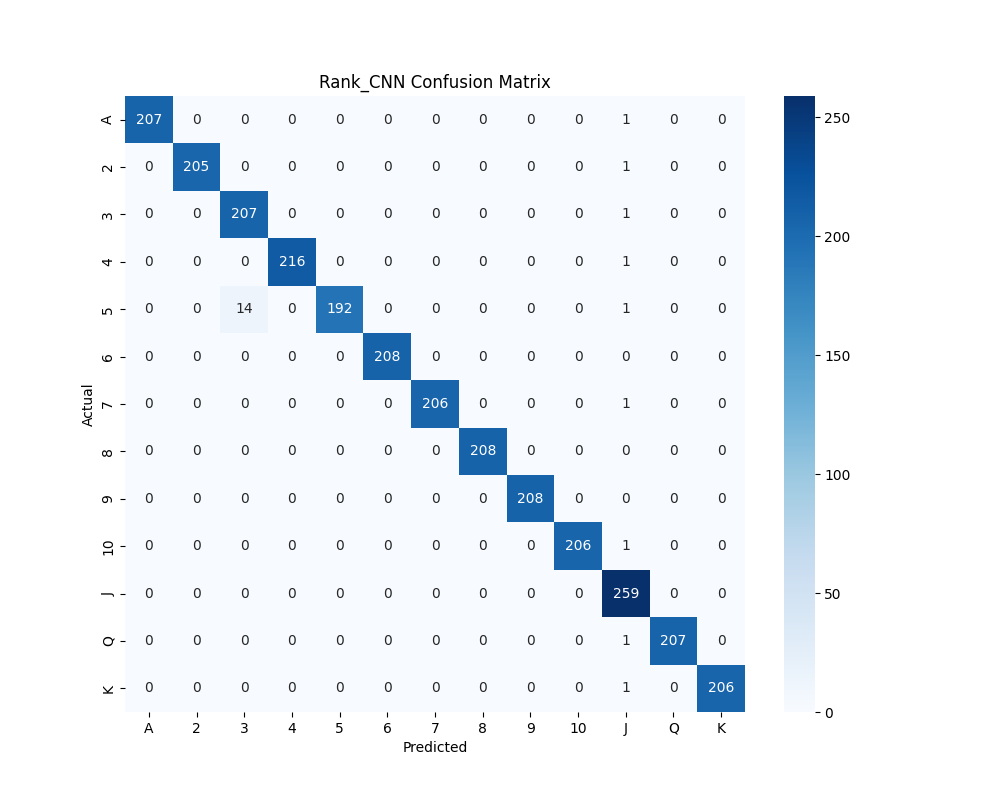

# Card Detection and Classification

This project detects playing cards from a live camera feed using a YOLO model for object detection and a CNN for card rank and suit classification.

---

## Features

- Detects cards in real-time using YOLO.  
- Classifies rank (A, 2–10, J, Q, K) and suit (Clubs, Diamonds, Hearts, Spades) using a CNN.  
- Displays bounding boxes and predicted labels on the live camera feed.  
- Evaluate CNN performance using `CNN_test.py` to view accuracy and confusion matrix.
- Confusion matrices for both rank and suit are provided below.

---

## Example Outputs

### Rank CNN Confusion Matrix


### Suit CNN Confusion Matrix


---
## Setup

### 1. Create a Virtual Environment

It is recommended to create a virtual environment before installing dependencies:

```bash
# Create a virtual environment named projectenv
python -m venv projectenv

# Activate the environment
# On macOS/Linux:
source projectenv/bin/activate
# On Windows:
projectenv\Scripts\activate
